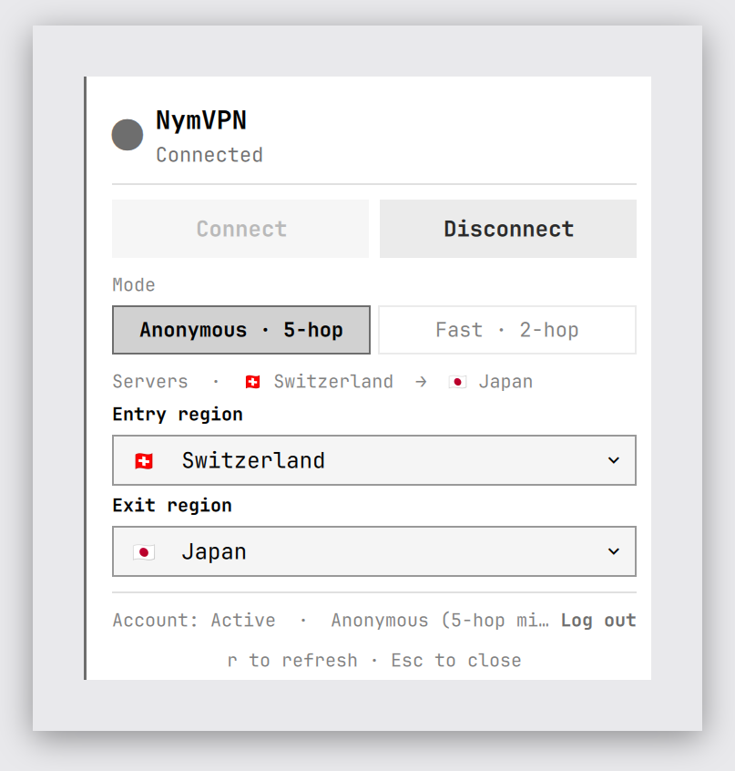

# NymVPN

Control [NymVPN](https://nym.com) from the Omarchy (Quattro) bar. The widget
shows live tunnel status; clicking it opens a panel to connect/disconnect,
switch between **Anonymous (5-hop mixnet)** and **Fast (2-hop WireGuard)** mode,
and pick entry/exit gateway countries — all by driving the official
`nym-vpnc` command-line client.



## Requirements

This plugin is a front-end for the NymVPN CLI. Install the NymVPN client and a
subscription/account first — see <https://nym.com/download/linux>.

On Arch / Omarchy — the daemon and GUI packages do **not** include the
`nym-vpnc` CLI, so install the CLI package (`nym-vpnc-bin`) explicitly:

```sh
yay -S nym-vpnc-bin nym-vpnd-bin           # CLI + daemon (nym-vpn-app-bin is the optional GUI)
sudo systemctl enable --now nym-vpnd       # start the privileged daemon
nym-vpnc account set <your recovery phrase>   # log in (run in a terminal)
```

The `nym-vpnd` daemon must be running for `nym-vpnc` to work. If the CLI or the
daemon is missing, the panel shows a setup card with the exact commands to run —
click the command box (or its **Copy** button) to copy it to the clipboard.

### Authentication prompts (polkit)

Recent `nym-vpnd` builds gate every daemon call behind a polkit action
(`com.nymvpn.vpnd.unix-access`, `allow_active = auth_self`), so **each**
`status` / `connect` / `disconnect` asks for your password. Because of this the
plugin **never polls in the background** — it only talks to the daemon when you
open the panel, press `r`, or click Connect/Disconnect, so you get at most one
prompt per action.

To stop the prompts entirely, allow the active local user without a password by
installing a polkit rule (the panel offers this command when authentication is
needed):

```sh
sudo tee /etc/polkit-1/rules.d/49-nymvpn.rules >/dev/null <<'EOF'
polkit.addRule(function(action, subject) {
  if (action.id == "com.nymvpn.vpnd.unix-access" && subject.active && subject.local) {
    return polkit.Result.YES;
  }
});
EOF
```

Then log out/in (or restart your polkit agent). This trades a little security for
convenience; skip it if you prefer to approve each prompt.

### Recovery-phrase handling (security)

You can log in two ways: run `nym-vpnc account set <phrase>` yourself in a
terminal, or use the panel's inline **Log in** (masked field, no full-screen
dialog, no clipboard).

Either way the mnemonic ends up on the `nym-vpnc` **command line**, because the
official CLI accepts the recovery phrase *only* as a positional argument
(`nym-vpnc account set <mnemonic>`) — it has no stdin, file, or environment-
variable input path. When the panel logs you in, the plugin therefore builds an
**argv array** (never a shell string), so the phrase is:

- never parsed by a shell (no injection, no shell history);
- never written to the clipboard, a file, or a log;
- passed straight to `nym-vpnd`, which stores it locally — it never leaves the
  machine;
- sent only on an explicit **Log in** click, never in the background, and held
  only in the masked field until the panel closes or login completes.

The one unavoidable exposure, shared with running `nym-vpnc account set` by hand,
is that the phrase is visible in that process's arguments (`/proc/<pid>/cmdline`)
for the brief duration of the login call. This is limited to other processes on
the same machine (your own user, or root); such a caller can already read
`nym-vpnd`'s stored credentials, so it is not a privilege escalation. The panel
states this caveat before you submit. On shared/multi-user hosts, prefer
completing the login in a controlled session (and consider `hidepid` on `/proc`)
if the login window matters to your threat model.

All other panel actions — `status`, `connect`, `disconnect`, `tunnel`, and
`gateway` — carry no secrets.

## Install

```sh
omarchy plugin add https://github.com/megabyte0x/nym-vpn.git --enable
```

## Usage

- **Left-click** the `nym` widget to open/close the control panel.
- **Middle-click** to force a status refresh.
- **Log in** with your NymVPN recovery phrase directly in the panel: click
  **Log in**, paste your 12–24 word phrase into the masked field, and press
  **Log in**. The phrase is entered inline (never a full-screen system dialog),
  passed straight to `nym-vpnd` which stores it locally — it never touches the
  clipboard or a log. Use **Log out** to forget the account.
- In the panel: **Connect** / **Disconnect**, choose **Mode**, and set an
  **Entry**/**Exit** country (two-letter ISO code, e.g. `US`, `DE`).
- Press **r** to refresh, **Esc** to close.

The bar dot reflects the tunnel state: filled = connected, half = connecting /
disconnecting, hollow = disconnected / error. Colour follows your theme accent
(connected) or urgent (error).

## Configure

```sh
omarchy bar move io.github.megabyte0x.nym-vpn --section right
```

## Remove

```sh
omarchy plugin remove io.github.megabyte0x.nym-vpn
```

## Develop

Pure command-building and output-parsing logic lives in `Model.js` and is unit
tested without Qt:

```sh
node tests/model-test.js
omarchy plugin validate .
qmllint -I "$OMARCHY_PATH/shell" BarWidget.qml Panel.qml
```

## License

MIT — see [LICENSE](LICENSE).
